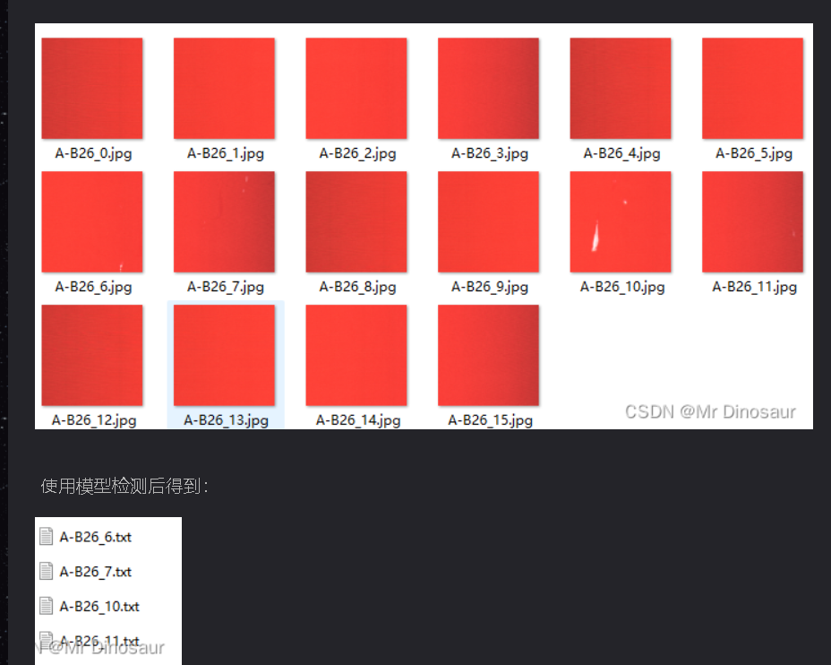
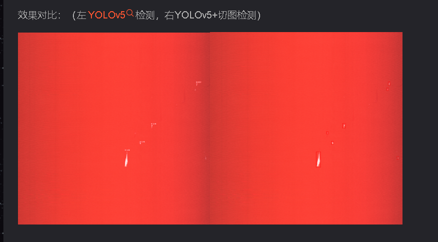

当我们在检测较大分辨率的图片时，对小目标的检测效果一直是较差的，所以就有了下面几种方法：

将图片压缩成大尺寸进行训练（ 想法：没显存，搞不来）
添加小检测头（想法：P5模型还有点用，P6模型完全没用）
添加一些检测模型和玄学机制（想法：你要是写论文就去看看知*吧，只需要在最后面加一句：已达到工业检测要求）
切图检测（想法：比较耗时，过程也比较繁琐，可以尝试）
切图检测

思路：

1. 将原图切成你想要的数量
2. 将切成的小图进行训练，得到模型
3. 将你需要检测的图片切成小图，用模型检测，并得到每张图目标位置的信息，保存在对应图片的txt文件
4. 将所有txt文件融合，得到1个txt文件，并在原图上显示
#一：切块

#二：融合txt文件
#三：原图显示

#参考
https://blog.csdn.net/qq_43622870/article/details/124984295?ops_request_misc=&request_id=&biz_id=102&utm_term=yolov5%E5%B0%8F%E7%9B%AE%E6%A0%87%E6%A3%80%E6%B5%8B&utm_medium=distribute.pc_search_result.none-task-blog-2~all~sobaiduweb~default-0-124984295.142^v68^control,201^v4^add_ask,213^v2^t3_control2&spm=1018.2226.3001.4187